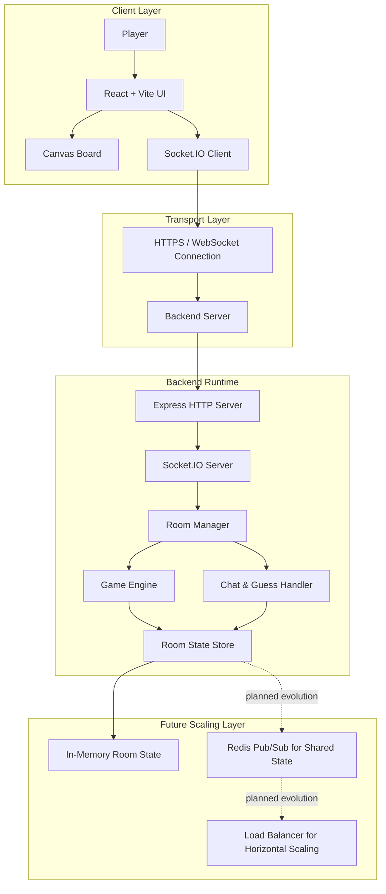
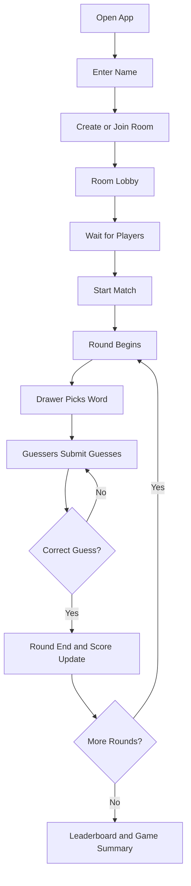

# DeluluDraw

DeluluDraw is a real-time multiplayer drawing and guessing game built as a full-stack, event-driven application. It combines a React frontend, a Node.js backend, and Socket.IO to deliver live gameplay where players can join rooms, draw, guess, chat, and compete in synchronized rounds.

Live Demo: https://delulu-draw.vercel.app/

This project is more than a game prototype. It is an engineering-oriented implementation of a real-time system with room management, game state synchronization, live event propagation, and a modular architecture that can evolve into a production-scale multiplayer platform.

---

## Why this project is valuable

DeluluDraw demonstrates several important software engineering concepts in one application:

- Real-time communication using WebSockets and event streaming
- Server-authoritative game state to avoid inconsistent or cheating behavior
- A clear separation between presentation, gameplay logic, and transport layer
- A modular backend that can grow into a multi-instance distributed system
- A polished frontend experience for interactive real-time gameplay

---

## What the product does

Players can:

- create or join rooms
- play turn-based drawing rounds
- guess the drawing in real time
- chat and exchange messages during gameplay
- track scores and leaderboard progression
- join ongoing rooms and experience synchronized updates

The game is designed to feel responsive and alive, even when multiple users interact at the same time.

---

## Core features

### Multiplayer room system

- public and private room support
- shared room-based gameplay experience
- dynamic player join and leave handling
- room-state synchronization across clients

### Game engine

- round-based turn flow
- word selection and drawing phase
- score updates and win conditions
- leaderboard progression

### Real-time interaction layer

- live drawing stroke propagation
- chat and guess messaging
- instant server-to-client updates
- event-driven communication between clients and backend

### User experience

- interactive canvas board
- responsive room UI
- real-time player presence updates
- smooth transition between lobby, round, and results

---

## System architecture

The system follows a layered architecture. The frontend handles interaction and visualization, while the backend owns the authoritative room and game state. Communication happens over WebSockets so the game feels live and synchronized.



### Architecture design notes

- The frontend is intentionally lightweight and focused on rendering and user interaction.
- The backend is the authoritative layer for game rules, timing, and room state.
- WebSocket events keep the experience consistent for all connected clients.
- The current implementation uses a single backend runtime with in-memory room state.
- For future growth, Redis pub/sub and load balancing can be introduced to support horizontal scaling and shared room coordination across multiple backend instances.

---

## Gameplay flow

The game flow is intentionally simple and easy to understand, while still supporting real-time coordination.



This flow keeps the game loop clear and easy to follow while still reflecting the real-time nature of the experience.

---

## How the stack works together

### Frontend: React + Vite + Tailwind CSS

React provides the component-based UI structure for the game pages, lobby, canvas experience, player list, and chat. It allows the interface to be broken into reusable pieces such as the canvas board, message box, room UI, and navbar.

Vite is used for fast development and build tooling. It makes the local development loop quick and efficient, which is especially useful when iterating on a real-time interface.

Tailwind CSS provides utility-first styling so the app can be styled quickly while staying maintainable. It helps create a modern UI without excessive custom CSS overhead.

### UI enhancement: Framer Motion

Framer Motion adds smooth animations and transitions to improve feel and interactivity. It helps make the app feel more alive when rooms change state, players join, or rounds transition.

### Canvas interaction: HTML5 Canvas API

The drawing experience is implemented through the browser canvas. This is the right choice for a real-time drawing game because it offers low-level control over strokes, colors, and drawing operations while remaining efficient for frequent updates.

### Transport layer: Socket.IO

Socket.IO is the core of the real-time communication system. It enables bidirectional event-based communication between client and server, which is essential for:

- sending drawing strokes instantly
- broadcasting chat and guess messages
- synchronizing room actions
- keeping all connected clients updated in near real time

It abstracts the complexity of WebSocket handling while also providing reliability features for event delivery.

### Backend runtime: Node.js + Express

Node.js is used because the application is highly event-driven and benefits from non-blocking I/O. This is ideal for a system that must handle many concurrent connections and frequent updates.

Express provides the HTTP server foundation and can manage routes, middleware, and structured request handling. In this project, it works alongside Socket.IO to support the game service as a unified backend application.

### State model: server-authoritative architecture

The backend acts as the source of truth for the game. This approach is important because a multiplayer game must avoid each client independently deciding room or scoring state. Instead:

- the server receives events
- validates them
- updates the game state
- broadcasts the resulting state to all players

This keeps the experience consistent and fair.

### Future scale layer: Redis + load balancing

The current version runs as a single backend process with in-memory state. For larger-scale deployment, the architecture can evolve into a horizontally scaled setup where:

- multiple backend instances serve different users
- Redis stores shared room and game state
- a load balancer distributes incoming socket traffic
- pub/sub events keep rooms synchronized across instances

This is the natural next step for turning the project into a production-grade real-time multiplayer service.

---

## Backend responsibilities

The backend is responsible for the logic and consistency of the game. It manages:

- room lifecycle and player presence
- room creation, joining, and leaving
- timing and round transitions
- word selection and score updates
- chat and guess events
- drawing event broadcasting
- room state synchronization across all clients

This ensures that all players see the same state at the same time.

---

## Frontend responsibilities

The frontend is responsible for the user-facing experience. It handles:

- lobby and room views
- player list and leaderboard UI
- canvas-based drawing input
- chat message display
- real-time updates from the server
- local interaction feedback and animations

The frontend is designed to stay focused on experience while the backend manages the truth of the gameplay.

---

## Project structure

```text
DeluluDraw/
├── Backend/
│   ├── src/
│   │   ├── constants/
│   │   ├── core/
│   │   ├── data/
│   │   ├── socket/
│   │   ├── store/
│   │   ├── utils/
│   │   └── index.js
│   └── package.json
│
├── Frontend/
│   ├── src/
│   │   ├── assets/
│   │   ├── components/
│   │   ├── hooks/
│   │   ├── pages/
│   │   ├── services/
│   │   ├── utils/
│   │   └── main.jsx
│   └── package.json
│
└── README.md
```

---

## Setup instructions

### 1. Backend

```bash
cd Backend
npm install
npm run dev
```

### 2. Frontend

```bash
cd Frontend
npm install
npm run dev
```

### 3. Environment variables

Backend example:

```env
PORT=4000
CLIENT_URL=http://localhost:5173
```

Frontend example:

```env
VITE_SERVER_URL=http://localhost:4000
```

---

## Development principles used in this project

This project was built around a few strong engineering principles:

- event-driven architecture for highly interactive systems
- clear separation of concerns between UI and game logic
- real-time synchronization over persistent connections
- low-overhead communication for drawing and chat events
- modularity so new features can be added without reworking the whole system

---

## Future roadmap

The next version of DeluluDraw can grow into a more advanced social and scalable multiplayer platform.

### Scalability and infrastructure

- horizontal scaling with multiple backend instances
- Redis-backed shared room state and pub/sub synchronization
- load balancer integration for socket distribution
- session affinity and connection routing optimization
- distributed matchmaking and room orchestration

### Social and multiplayer enhancements

- friend invites and private friend lobbies
- room joining by code or direct invitation links
- spectator mode
- replay and match-history support
- team-based and tournament-style modes

### Product and experience upgrades

- authentication and user profiles
- persistent stats and global leaderboards
- AI-assisted drawing hints
- mobile-first usability improvements
- stronger reconnect and recovery systems

---

## Conclusion

DeluluDraw is a practical and well-structured example of a real-time multiplayer system built with modern web technologies. It combines engaging gameplay with thoughtful architecture, and it provides a strong foundation for future growth into a larger, more scalable, and more social online game platform.

