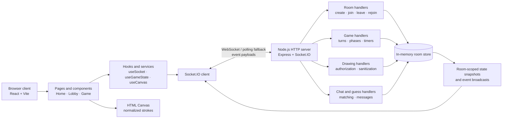
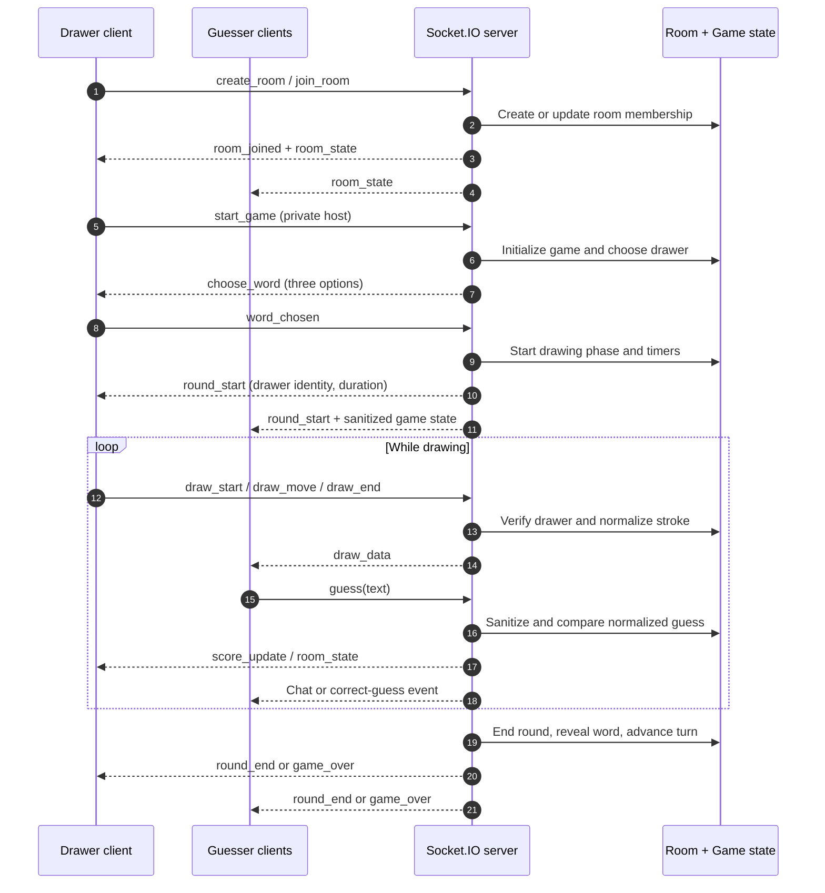
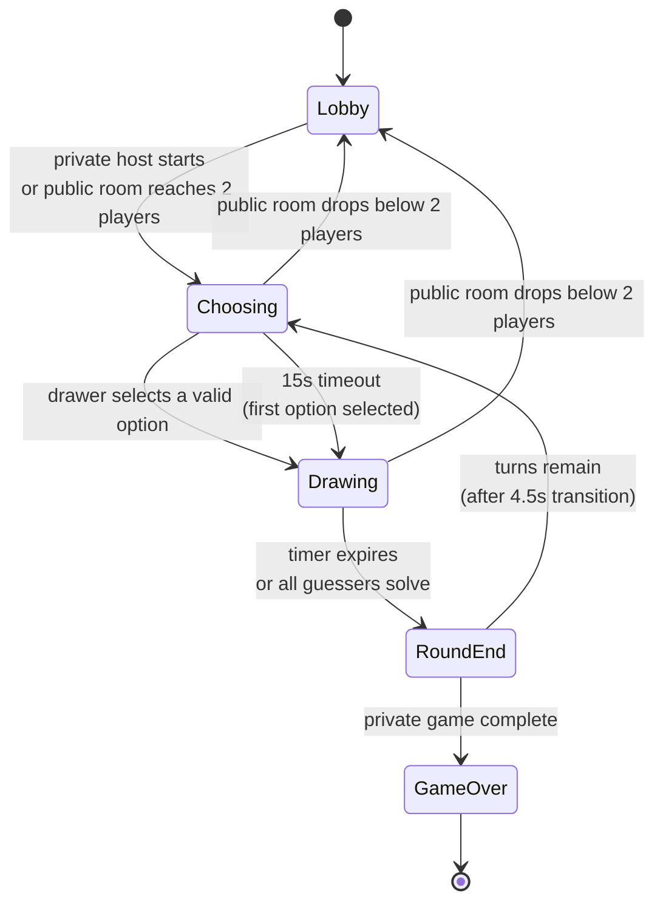
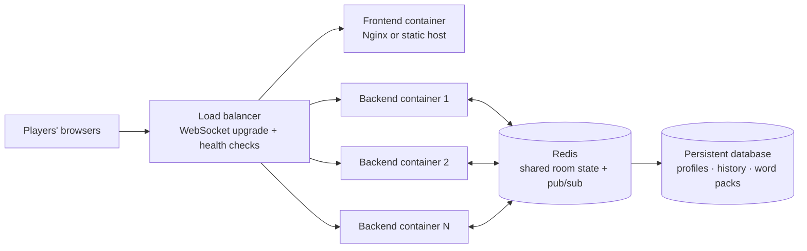

# DeluluDraw

> A real-time multiplayer drawing and guessing game built with React, Node.js, Express, and Socket.IO.

[Live demo](https://delulu-draw.vercel.app/)

DeluluDraw is a browser-based, event-driven multiplayer game in which one player draws a secret word while the rest of the room guess it through live chat. The backend is the source of truth: it owns the room and player lifecycle, validates every client intent, enforces role and phase permissions, advances the game state machine, schedules authoritative timers, calculates scores, sanitizes user input, and publishes role-aware state snapshots to connected clients. The React client is deliberately presentation-focused; it captures user actions, renders the latest server state, and never decides whether a move, guess, score, or transition is valid.

This makes DeluluDraw more than a canvas UI with a socket connection. It is a small multiplayer backend with explicit domain models, room-scoped event routing, server-side authorization, disconnect recovery, deterministic turn progression, and controlled serialization that prevents hidden game information from leaking to guessers.

The repository is intentionally split into two independently runnable applications:

- `Frontend/` — the React/Vite client, UI components, canvas input, animations, and Socket.IO client.
- `Backend/` — the Node.js/Express service, Socket.IO event handlers, in-memory room store, game engine, validation, timers, and score calculation.

## Product capabilities

- Join the public `GLOBAL` match, which starts automatically when at least two players are present.
- Create a private room with a generated five-character code and invite other players.
- Configure the number of rounds in a private-room lobby.
- Rotate the drawer across turns and offer the drawer three server-selected word options.
- Draw on an HTML canvas with live stroke, color, size, and clear-canvas events.
- Guess through the chat channel, with server-side exact-match checking and progressive hints.
- Award points to guessers and the drawer, then publish live score and leaderboard updates.
- Join custom rooms as a spectator; public matches also support majority-vote kicking when at least three players are present.
- Preserve a disconnected player's state for 30 seconds so they can reconnect without losing their score or turn position.
- Expose `GET /health` for a lightweight service and room-count check.

## Architecture

The server is authoritative. Clients send intents such as `join_room`, `word_chosen`, `draw_move`, and `guess`; the server validates the sender and current game phase, mutates the room model, and emits the resulting state or event to the appropriate Socket.IO room.



### Runtime responsibilities

| Layer | Responsibility | Main implementation |
| --- | --- | --- |
| Presentation | Render home, lobby, game board, player list, chat, and transitions | `Frontend/src/pages`, `Frontend/src/components` |
| Client state | Track connection identity, room snapshots, messages, word options, and rejoin state | `Frontend/src/hooks`, `Frontend/src/App.jsx` |
| Transport | Provide bidirectional, room-scoped event delivery | Socket.IO client/server |
| Domain model | Represent players, rooms, game phases, turns, scores, and canvas history | `Backend/src/core` |
| Application logic | Validate events, authorize actions, run timers, calculate scores, and handle disconnects | `Backend/src/socket`, `Backend/src/utils` |
| Persistence | Store active rooms and game state for the lifetime of the process | `Backend/src/store/rooms.js` |

## Real-time game flow



### Game state machine



## Event and state design

Socket.IO events are grouped by responsibility rather than placed in a single handler. This keeps transport concerns separate from domain operations and makes authorization rules explicit.

| Concern | Client-to-server events | Server-to-client results |
| --- | --- | --- |
| Room lifecycle | `create_room`, `join_room`, `quit_room`, `rejoin_room` | `room_joined`, `room_state`, `room_rejoined`, `room_left` |
| Lobby controls | `update_room_settings`, `start_game`, `vote_kick` | `kick_vote`, `kicked_from_room`, `error` |
| Round lifecycle | `word_chosen` | `choose_word`, `round_start`, `round_end`, `game_over`, `game_state` |
| Drawing | `draw_start`, `draw_move`, `draw_end`, `canvas_clear` | `draw_data`, `canvas_clear` |
| Chat and scoring | `guess` | `message`, `score_update` |
| Connection recovery | `session_ready`, `PING` | `rejoin_available`, `pong` |

The server serializes room snapshots differently for each socket: the drawer receives the current word and word options, while other players receive only the public game information and revealed hint indexes. Drawing events are accepted only from the active drawer during the `drawing` phase; coordinates and brush sizes are clamped before they are broadcast.

## Technology choices

### Frontend

- **React 19** provides the component model and application composition.
- **Vite** provides the development server and production bundling.
- **Tailwind CSS 4** supplies utility-first styling through the Vite plugin.
- **Framer Motion** drives page, modal, and interaction animations.
- **React Icons** provides interface icons.
- **Socket.IO Client** maintains the real-time connection and sends gameplay events.
- **HTML Canvas API** captures normalized drawing strokes so the server can relay and replay them across clients.

### Backend

- **Node.js** runs the event-driven multiplayer service.
- **Express 5** creates the HTTP server and exposes the health endpoint.
- **Socket.IO 4** manages persistent client connections, room broadcasts, and the polling fallback.
- **CORS** restricts browser requests and Socket.IO handshakes to the configured frontend origin.
- **dotenv** loads runtime configuration from `Backend/.env`.
- **nanoid** generates collision-resistant, five-character private room codes.
- **CommonJS modules** are used by the backend; the frontend uses native ES modules through Vite.

### State and consistency model

The current backend has no database. Active `Room`, `Player`, and `Game` objects live in process memory, with `words.json` as the static word source. This makes the project simple to run and fast for a demo, but restarting the backend clears rooms and scores. Horizontal scaling will require shared state and Socket.IO adapter infrastructure, such as Redis, plus container orchestration and a deployment strategy for connection affinity.

## Repository layout

```text
DeluluDraw/
├── Backend/
│   ├── src/
│   │   ├── constants/       # Event names and game defaults
│   │   ├── core/            # Room, Player, and Game domain models
│   │   ├── data/            # Static word list
│   │   ├── socket/          # Room, game, drawing, and chat handlers
│   │   ├── store/           # In-memory active-room registry
│   │   ├── utils/            # Validation, serialization, scoring, timers
│   │   └── index.js         # Express + Socket.IO entry point
│   ├── .env.example
│   └── package.json
├── Frontend/
│   ├── src/
│   │   ├── components/      # Layout, home, lobby, and game UI
│   │   ├── hooks/            # Socket, game-state, and canvas behavior
│   │   ├── pages/            # Home, Lobby, and Game screens
│   │   ├── services/         # Socket client factory
│   │   ├── utils/            # Client defaults and palette
│   │   ├── App.jsx
│   │   └── main.jsx
│   ├── public/
│   ├── .env.example
│   └── package.json
└── README.md
```

## Local development

### Prerequisites

- Node.js 18 or newer
- npm 9 or newer

### 1. Start the backend

```bash
cd Backend
npm install
copy .env.example .env       # Windows
# cp .env.example .env       # macOS/Linux
npm run dev
```

The backend listens on `http://localhost:4000` by default. Verify it with:

```bash
curl http://localhost:4000/health
```

### 2. Start the frontend

In a second terminal:

```bash
cd Frontend
npm install
copy .env.example .env       # Windows
# cp .env.example .env       # macOS/Linux
npm run dev
```

Open the Vite URL shown in the terminal, normally `http://localhost:5173`.

### Environment variables

`Backend/.env`:

```env
PORT=4000
CLIENT_URL=http://localhost:5173
```

`Frontend/.env`:

```env
VITE_SERVER_URL=http://localhost:4000
```

`CLIENT_URL` and `VITE_SERVER_URL` must point to the corresponding origins when deploying the two applications separately.

## Available commands

### Frontend

```bash
npm run dev       # Start Vite development server
npm run build     # Create a production build
npm run preview   # Serve the production build locally
npm run lint      # Run ESLint
```

### Backend

```bash
npm run dev       # Start with nodemon
npm start         # Start the Node.js server
```

## Future goals

The roadmap focuses on making the backend horizontally scalable while expanding custom-room creativity and the quality of the drawing experience.

### Horizontal scaling and deployment

- Containerize the frontend and backend with production-ready Dockerfiles and a Docker Compose development environment.
- Move active room state, player sessions, timers, and reconnect metadata from process memory into Redis or a Redis-compatible shared state layer.
- Add the Socket.IO Redis adapter so events emitted by one backend instance reach clients connected to other instances.
- Put multiple stateless backend containers behind a load balancer or reverse proxy such as Nginx, Traefik, or a managed cloud load balancer.
- Configure WebSocket upgrade support, health checks, graceful shutdown, and connection draining for rolling deployments.
- Use Redis pub/sub for cross-instance room broadcasts and distributed coordination, while keeping game transitions protected against duplicate timer execution.
- Add persistent storage for accounts, match history, custom word packs, player statistics, and global leaderboards.

The target deployment shape is:



### Custom-room features

- Let hosts create, edit, import, and share custom word lists or themed word packs.
- Support per-room rules such as round count, draw duration, hint behavior, scoring mode, language, and player/spectator limits.
- Add optional voice chat for players in the same room, using WebRTC for media and the backend only for signaling and room permissions.
- Add optional room music or synchronized song playback for entertainment between rounds, with host-controlled play/pause, queue, and volume state.
- Add room moderation controls, mute/report actions, invitation links, and persistent room presets.
- Support team modes, audience voting, spectators, private tournaments, and replayable match summaries.

### Drawing-board improvements

- Add undo/redo, eraser mode, fill bucket, shape tools, line smoothing, and richer brush controls.
- Improve high-frequency stroke transport with batching, throttling, compression, and adaptive update rates.
- Keep the server authoritative for permissions while moving rendering and interpolation work to the client for a smoother board.
- Add responsive pointer, touch, and stylus support with pressure-aware brush size where available.
- Improve canvas recovery with versioned snapshots, late-join synchronization, and efficient replay of existing strokes.
- Add export/share options for completed drawings and optional round replay timelines.

## Current limitations

- Room and score state is process-local and is lost when the backend restarts.
- Only one backend instance can safely coordinate the active in-memory rooms.
- There is no authentication or persistent account/profile system.
- The word list is static and currently stored in `Backend/src/data/words.json`.
- Automated unit, integration, and end-to-end tests are not yet included.

## Engineering focus

DeluluDraw is a compact example of a server-authoritative, event-driven application. Its most important design decisions are explicit boundaries: React owns presentation, Socket.IO carries intents and updates, the backend owns mutable game state, and serializers control which information each role is allowed to see. That structure keeps the current game understandable while leaving clear seams for persistence, scaling, testing, and additional game modes.
